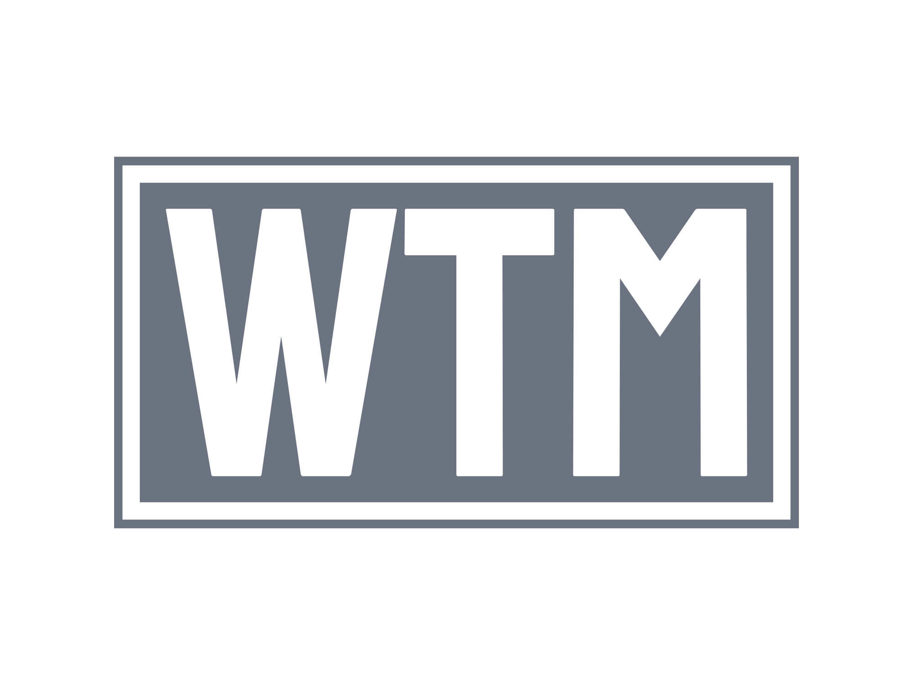

<!-- PROJECT LOGO -->
<br />
<div align="center">
  <a href="https://github.com/ogdhruv/whats-the-meaning">
  
  </a>

  <h1 align="center">What's the meaning</h1>

  <p align="center" style="font-size:large">
    An awesome graphical cli dictionary !
    <br />
  </p>
</div>

<br>

<!--  -->
## DEMO 🎥

[](https://asciinema.org/a/MfRK2UkKOSL1VjhNRwIlNIlzH)

## Prerequisites 💻️

This is a project written in **Python**
* [Poetry](https://python-poetry.org/docs/#installation)


* [rich](https://github.com/Textualize/rich)

  ```bash
  pip install rich
  ```

## Installation 🔨

_Below is the instruction of how to install this command line application._

1. Clone the repo

   ```bash
   git clone https://github.com/ogdhruv/whats-the-meaning.git
   ```
2. Install poetry packages

   ```bash
   poetry install
   ```


<!-- USAGE EXAMPLES -->
## Usage
```bash
poetry run wtm <word>
```

See the [open issues](https://github.com/ogdhruv/whats-the-meaning/issues) for a full list of proposed features (and known issues).

# Features 🌟

> Some features that WTM comes with:

- An interactive & beautiful command line interface
- Easy to use
- Using an open dictionary api

[](https://python.org)

<!-- CONTRIBUTING -->
## Contributing 🤝

Contributions are what make the open source community such an amazing place to learn, inspire, and create. Any contributions you make are **greatly appreciated**.

If you have a suggestion that would make this better, please fork the repo and create a pull request. You can also simply open an issue with the tag "enhancement".
Don't forget to give the project a star! Thanks again!

1. Fork the Project
2. Create your Feature Branch (`git checkout -b feature/AmazingFeature`)
3. Commit your Changes (`git commit -m 'Add some AmazingFeature'`)
4. Push to the Branch (`git push origin feature/AmazingFeature`)
5. Open a Pull Request

<!-- LICENSE -->
## License

Distributed under the MIT License.

<p align="right">(<a href="#readme-top">back to top</a>)</p>
